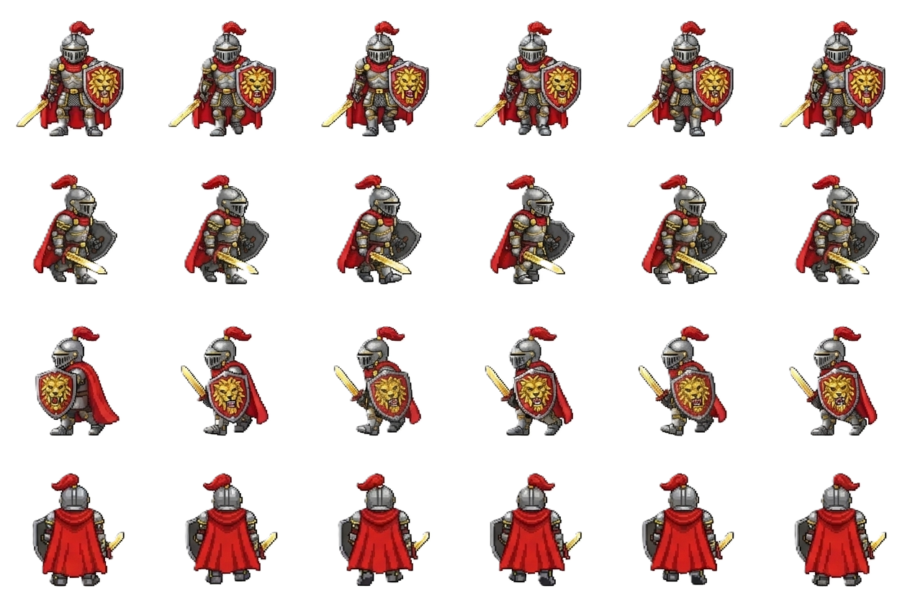
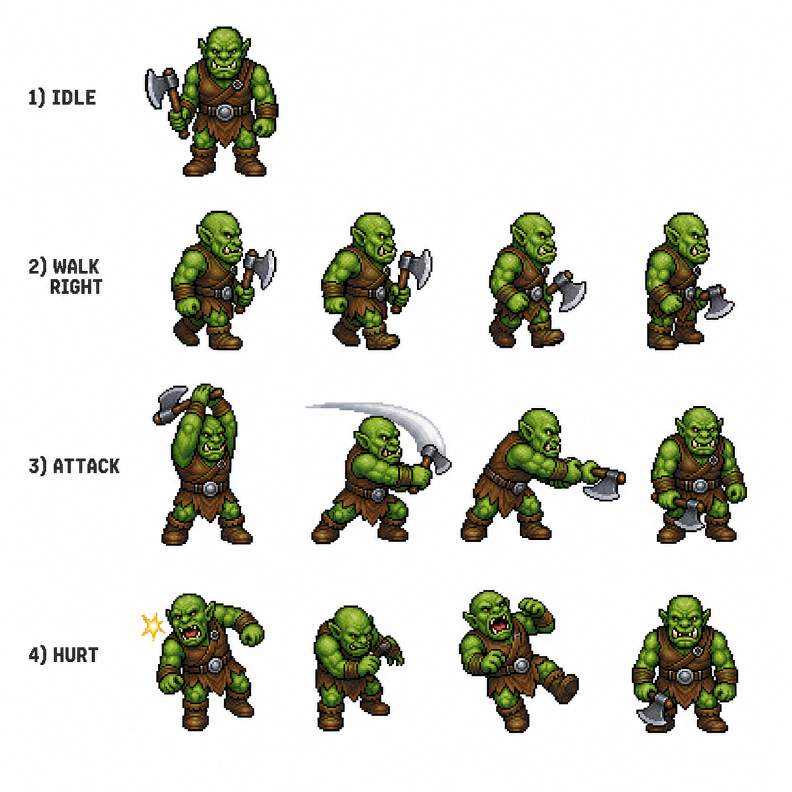

# Player
=== STYLE BIBLE: [SEU JOGO] ===
Pixel art, 16-bit SNES JRPG era, reminiscent of "The Legend of Zelda: A Link to the Past". Limited palette of 24 neon colors: grey, gold, red and blue . 1-pixel dark outline. Soft dithered shadows. Centered subject on uniform white background. No text, no UI, no borders, no watermarks. 
=== END STYLE ===
 
ASSET TO GENERATE: 
Pixel art caracter , knight with a gold sword and silver shield , full body, 64x64 sprite cell
Replace the shield with a lion-faced shield, with a predominantly blue color palette, and also make the knight's vision beam blue.
Generate a character sprite sheet (tileset) for a top-down RPG. Maintain the character's exact identity and design in these poses: 1) Idle (facing forward), 2) Walking Right (4 frame animation loop), 3) Attacking (4 frame animation sequence), 4) Hurt (4 frame animation).

# Orc
=== STYLE BIBLE: RPG Medieval ===
Pixel art, 16-bit SNES JRPG era, reminiscent of "The Legend of Zelda:
A Link to the Past". Limited palette of 24 neon colors:
dark green, brown, gray, yellow, black and white. 1-pixel dark outline.
Soft dithered shadows. Centered subject on uniform white background.
No text, no UI, no borders, no watermarks.
=== END STYLE ===
ASSET TO GENERATE: Middle-aged orc, wielding an axe, wearing leather clothing and a metal belt. Idle pose facing camera, full body, 64x64 sprite cell.
Generate a character sprite sheet (tileset) for a top-down RPG. Maintain the character's exact identity and design in these poses: 1) Idle (facing forward), 2) Walking Right (4 frame animation loop), 3) Attacking (4 frame animation sequence), 4) Hurt (4 frame animation).

# Witch
A comprehensive pixel art character sprite sheet for a 16-bit JRPG witch character. The character has long vibrant red hair, glowing red eyes, a tall blue witch hat, a blue cloak, and a golden magic staff with a glowing blue gem. \n\nThe sprite sheet is organized into a clean grid on a uniform white background. It includes 6 distinct rows, one for each action: 1) Idle, 2) Walking Right, 3) Walking Down, 4) Walking Up, 5) Attacking, and 6) Hurt. Each row contains 4 frames of animation for that action. \n\nStyle: 16-bit SNES era, reminiscent of 'The Legend of Zelda: A Link to the Past', 1-pixel dark outline, soft dithered shadows, limited neon palette of grey, gold, red, and blue. No text, no UI, no borders, no watermarks, professional game asset style." }",
"thought": "I will generate a sprite sheet following the user's specific request for a 16-bit JRPG style character. I have included all the requested poses: idle, walking right, walking down, walking up, attacking, and hurt, with 4 frames per animation, all on a white background, maintaining the visual identity of the witch character established previously.

Pixel art, 16-bit SNES JRPG era, reminiscent of "The Legend of Zelda: A Link to the Past". Limited palette of 24 neon colors: grey, gold, red and blue. 1-pixel dark outline. Soft dithered shadows. Centered subject on uniform white background. No text, no UI, no borders, no watermarks.

RESOURCE TO BE GENERATED: witch with human aparence, red eyes and using one staf, a single sprite, 32x32 sprite cell.

Generate a character sheet with 4 poses for each position of this exact character:
idle, walking right, attacking, hurt, walking down and walking up. White background.

# Dragon
=== STYLE BIBLE: [SEU JOGO] ===
Pixel art, 16-bit SNES JRPG era, reminiscent of "The Legend of
Zelda: A Link to the Past". Limited palette of 24 [warm/cold/neon]
colors: [liste as cores específicas]. 1-pixel dark outline.
Soft dithered shadows. Centered subject on uniform white background.
No text, no UI, no borders, no watermarks.
=== END STYLE === Pixel art caracter , the red fury dragon , full body, 32x32 sprite cell
16-bit, vibrant red scales, breathing tiny fire particles . 

Generate a character sprite sheet (tileset) for a top-down RPG. Maintain the character's exact identity and design in these poses: 1) Idle (facing forward), 2) Walking Right (4 frame animation loop), 3) Attacking (4 frame animation sequence), 4) Hurt (4 frame animation)

